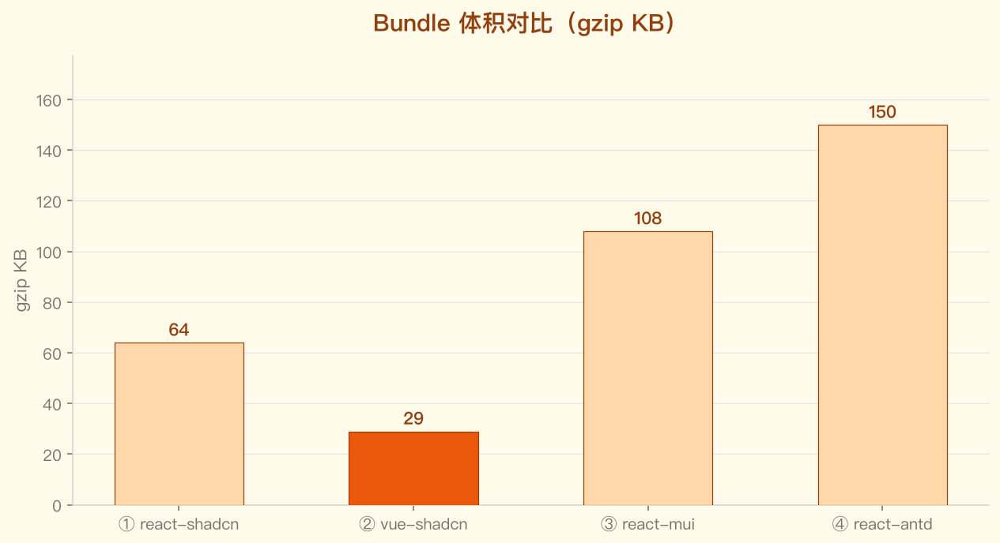
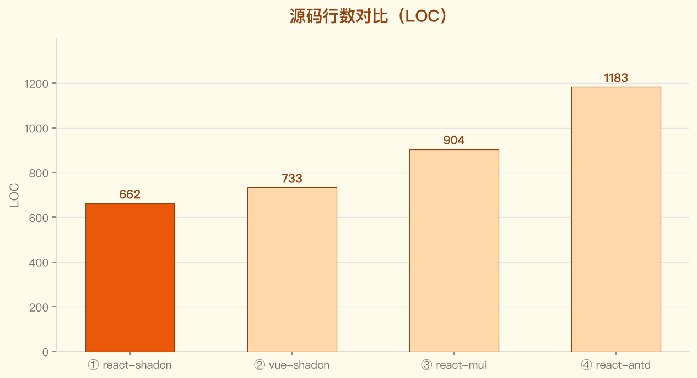
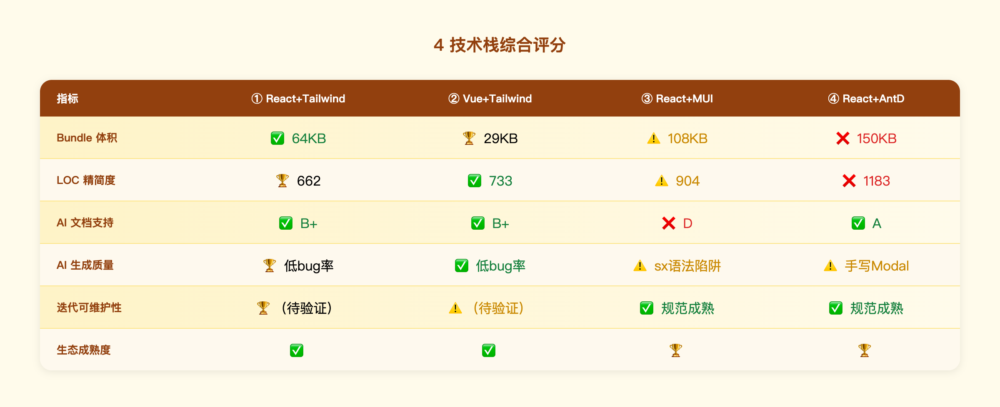

# 组件库对比 — 单次质量快照（Method A）

> 测量日期：2026-06-30  
> 版本：复杂版 v2（3关/4星型/Modal栈/localStorage/彩带/badge）  
> 测试：Playwright 9/9 ✅，0 console error

---

## Bundle 体积

| 栈 | JS 裸包 | gzip | CSS | CSS gzip |
|----|---------|------|-----|----------|
| ① react-shadcn | 205 KB | **64 KB** | 15.5 KB | 3.9 KB |
| ② vue-shadcn | 77 KB | **29 KB** | 15.3 KB | 3.8 KB |
| ③ react-mui | 342 KB | **108 KB** | 0.2 KB | 0.1 KB |
| ④ react-antd | 460 KB | **150 KB** | 3.1 KB | 1.2 KB |

*图：vue-shadcn 体积最小（29KB gzip），AntD 是其 5.2 倍；runtime CSS-in-JS 是 MUI/AntD 体积膨胀的主因。*

**结论**：
- Vue3+Tailwind 体积最小（29 KB），框架本身轻量 + Tailwind 树摇激进。
- React+shadcn/Tailwind 64 KB，shadcn 是 copy-in 无 runtime，Tailwind 原子类编译期消除。
- MUI 108 KB，内含 emotion runtime + MUI 组件树。
- AntD 150 KB，内含完整 antd runtime + CSS-in-JS。

---

## 源码行数

| 栈 | App | 组件 | data/lib | 合计 |
|----|-----|------|---------|------|
| ① react-shadcn | 145 | 368 | 91+58 | **662** |
| ② vue-shadcn | 175 | 413 | 91+54 | **733** |
| ③ react-mui | 143 | 576 | 185+28 | **904** |
| ④ react-antd | 237 | 622 | 236+38 | **1183** |

*图：react-shadcn 最精简（662 LOC）；react-antd 是其 1.8 倍，样式全内联 + ModalStack 手写是主因。*

**注**：③④ LOC 更多主因是样式全内联（MUI sx / AntD style），无法像 Tailwind 那样用类名压缩表达；data/levels.ts 因类型定义更细也更长。

---

## AI 文档支持

| 栈 | llms.txt | MCP | 评级 |
|----|---------|-----|------|
| react-shadcn | ✅ v0 default | — | B+ |
| vue-shadcn | ✅ vuejs.org/llms.txt | — | B+ |
| react-mui | ❌ 404 | — | D |
| react-antd | ✅ 6 个 llms.txt | ✅ antd-mcp-server | **A** |

---

## 综合评分

*图：① 在 AI 生成质量和代码精简度综合最优；② 体积最优；③④ 适用已有企业规范场景。*
