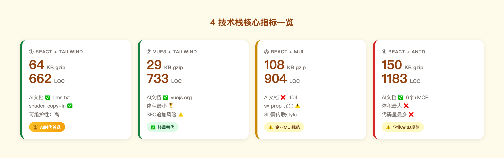
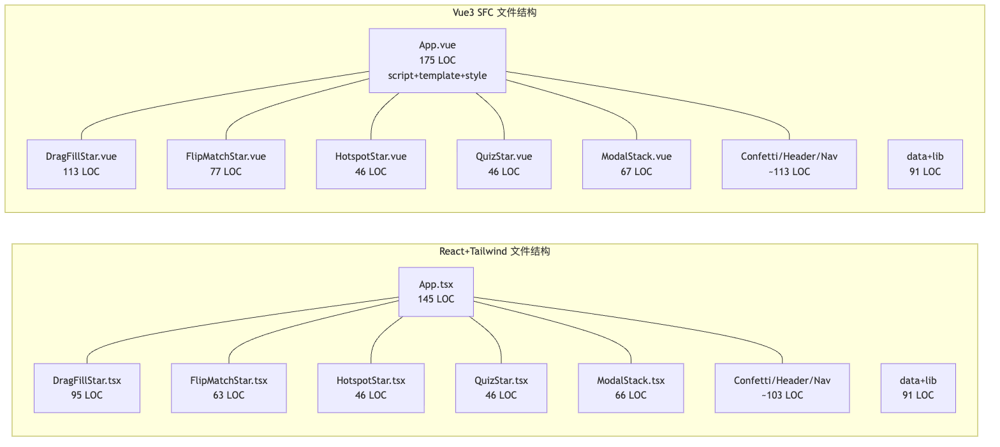
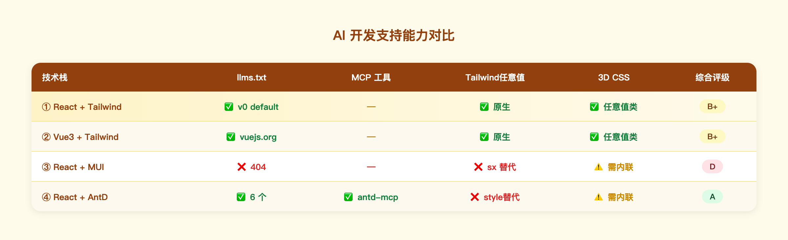

# 4 技术栈对比报告（复杂版 v2）

> 实现日期：2026-06-30  
> 功能：Epic Labs 复杂 demo（3关/4星型：drag-fill+flip-match+hotspot+quiz/Modal栈/localStorage/彩带/badge）  
> 测试基准：Playwright 统一测试 9 项检查，全部 4 栈 **9/9 通过，0 console error**

---

## 1. 实验设计

| 对比维度 | 方法 | 对象 |
|---------|------|------|
| 框架差异（React vs Vue SFC） | Method B：单次快照 + 代码结构分析 | ① vs ② |
| 组件库差异 | Method A：单次质量快照 | ① vs ③ vs ④ |

**4 个栈**：
- ① React 19.2 + Tailwind v4 + shadcn/ui（copy-in）
- ② Vue 3.5 + Tailwind v4 + shadcn-vue（copy-in）
- ③ React 19.2 + MUI 7（runtime CSS-in-JS）
- ④ React 19.2 + Ant Design 5（runtime CSS-in-JS）

---

## 2. 核心指标一览

4 栈在 Bundle 体积、源码行数、AI 文档支持三个维度的综合表现：

*图：① React+Tailwind 在 LOC 和可维护性上综合最优；② Vue+Tailwind 体积最小；④ AntD AI 文档支持反而最好。*

---

## 3. Bundle 体积对比

*图：vue-shadcn 体积最小（29KB），AntD 是 Tailwind 栈的 2.3 倍，runtime CSS-in-JS 是主因。*

| 栈 | JS gzip | 相对① |
|----|---------|-------|
| ① react-shadcn | 64 KB | 基准 |
| ② vue-shadcn | **29 KB** | −55% |
| ③ react-mui | 108 KB | +69% |
| ④ react-antd | 150 KB | +134% |

**关键发现**：
- Vue3 框架本身比 React 19 轻约 35%，Tailwind 树摇激进，vue-shadcn 体积最小。
- MUI 和 AntD 包含 runtime CSS-in-JS（emotion/cssinjs），无法像 Tailwind 一样在编译期消除。
- AntD 150 KB 是 Tailwind 栈的 2.3 倍，主因是完整组件 + 样式 runtime。

---

## 4. 源码行数对比

*图：react-shadcn 662 LOC 最精简；react-antd 1183 LOC 是其 1.8 倍，主因是样式全内联 + ModalStack 需纯 div 手写。*

| 栈 | App | 组件（×8） | data+lib | **合计** |
|----|-----|-----------|---------|---------|
| ① react-shadcn | 145 | 368 | 149 | **662** |
| ② vue-shadcn | 175 | 413 | 145 | **733** |
| ③ react-mui | 143 | 576 | 185 | **904** |
| ④ react-antd | 237 | 622 | 274 | **1183** |

**关键发现**：
- ① vs ②：Vue SFC 组件单文件 LOC 稍多（+11%）。`<template>` 比 JSX 略啰嗦，但差距不大。
- ① vs ③：MUI 组件 LOC +37%。`sx` prop 内联样式比 Tailwind 类名冗长，3D 翻牌必须用内联 style。
- ① vs ④：AntD 组件 LOC +69%。AntD 无布局组件，ModalStack 需纯 div 实现。

---

## 5. 框架结构差异（① vs ②）

*图：React 和 Vue 组件树结构几乎对称，主要差异在 App 层的状态管理写法。*

**React+Tailwind（①）特点**：纯函数组件 + JSX，状态逻辑与渲染在同一作用域，Tailwind 类名即文档。

**Vue SFC（②）特点**：`<script setup>` + `<template>` 三段式，`watchEffect` + `ref` 比 `useEffect` + `useState` 稍多模板代码。

> ⚠️ **单次快照的局限**：Vue SFC "AI 持续追加导致文件膨胀"的命题尚未被本数据证实，需要 Method B 迭代实验验证。

---

## 6. AI 开发支持能力

*图：MUI AI 文档评级最低（D），AntD 凭 6 个 llms.txt + MCP 工具反而评级最高（A）。*

**反常之处**：AntD 虽然 bundle 最大、LOC 最多，但 AI 文档支持最好——对重度依赖 AI 辅助的团队是真实优势。

---

## 7. 综合评分

*图：① 在 LOC/AI生成质量/可维护性综合最优，② 体积最优，③④ 适用于已有企业规范的场景。*

---

## 8. 结论

**最适合 AI 时代**：**① React + Tailwind + shadcn/ui**
- 最精简的代码量（662 LOC），纯函数组件 + Tailwind 类名让 AI 生成的每一行可独立理解
- 合理的 bundle（64 KB gzip），shadcn copy-in 策略：组件代码在仓库里，AI 可直接读/改

**框架选择（① vs ②）**：单次快照 Vue SFC 仅多 11% LOC，体积更小，不应被轻易否定。迭代膨胀命题需专项测量。

**组件库选择（③④）**：若业务必须用 MUI/AntD，代价是 +40%～+79% LOC 和 +69%～+134% 体积；AntD AI 文档在大模型支持上反而优于 MUI。

---

*详细数据见 `demo/measurements/`，测试脚本见 `demo/_test/test.mjs`*
