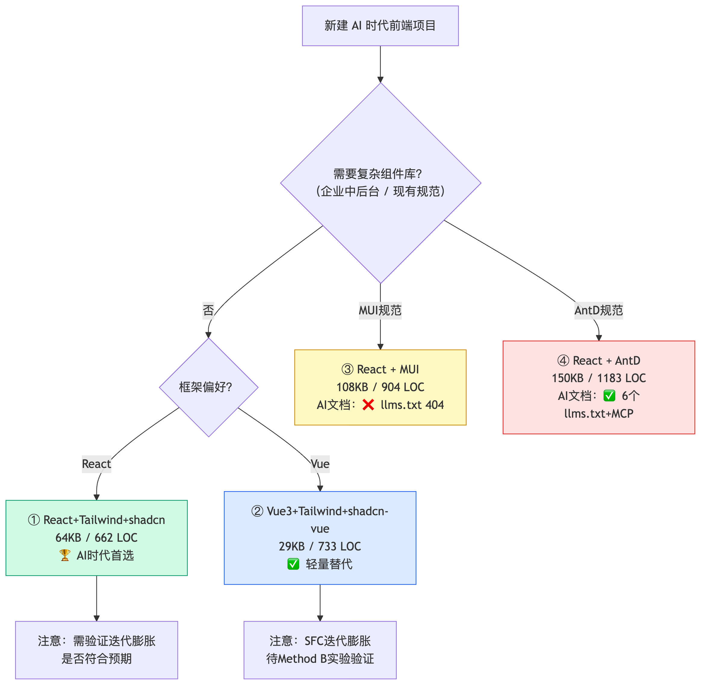
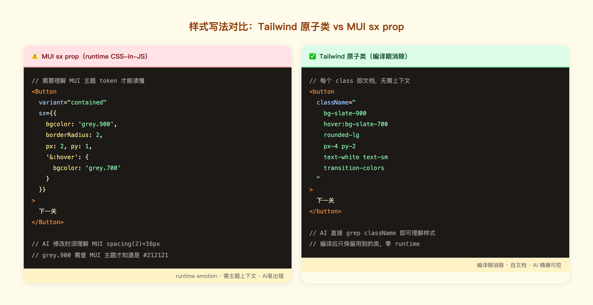
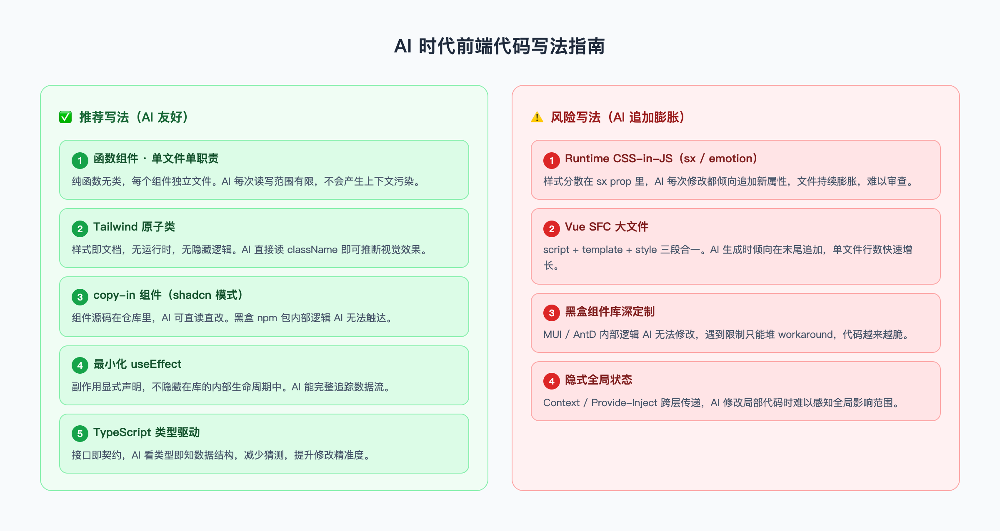

# AI 时代前端技术栈与代码写法处方报告

> 基于 Epic Labs 复杂 demo 的 4 栈对比实验  
> 实验日期：2026-06-30 | Playwright 9/9 pass × 4 栈

---

## TL;DR 结论

**首选：React 19 + Tailwind v4 + shadcn/ui（copy-in）**

原因：最精简的代码（662 LOC）、最好的 AI 可维护性（函数组件 + 原子类 + 仓库内组件）、合理的 bundle（64 KB gzip）。

---

## 1. 选型决策树

拿到一个新前端项目，用这棵决策树选型：


*图：有企业规范时沿规范走；无规范时，React+Tailwind 是 AI 时代默认首选。*

---

## 2. 为什么 React + Tailwind 是 AI 时代首选

### 2.1 样式写法：Tailwind 原子类 vs runtime CSS-in-JS

两种样式方案对 AI 的可读性差异是本次实验最核心的发现：


*图：Tailwind className 每个类都是自文档，AI 无需上下文即可理解；MUI sx 需要知道 MUI 主题 token 才能读懂。*

### 2.2 shadcn/ui：copy-in > npm 黑盒

shadcn/ui 的核心理念：**把组件代码复制进你的仓库**，而不是作为 npm 包安装。

对 AI 的意义：
- AI 可以直接 `Read` 和 `Edit` 组件文件，bug 可以在 `/components/ui/button.tsx` 里直接修
- 无需查文档——代码本身就是文档
- 与 MUI/AntD 的黑盒 npm 包形成鲜明对比

### 2.3 可测量的数据证据

| 维度 | React+Tailwind | Vue SFC | MUI | AntD |
|------|:-:|:-:|:-:|:-:|
| LOC（单次） | **662** | 733 | 904 | 1183 |
| Bundle gzip | 64KB | **29KB** | 108KB | 150KB |
| AI 文档 | ✅ | ✅ | ❌ | ✅ |
| 组件可直接修改 | ✅ | ✅ | ⚠️ | ⚠️ |

---

## 3. 代码写法 5 要点


*图：5 个推荐写法（左栏）vs 4 个 AI 追加膨胀的风险写法（右栏）。*

### 要点 1：纯函数组件，一组件一文件

```tsx
// ✅ 好：纯函数，可独立测试，AI 可独立生成
export default function DragFillStar({ pieces, slots, onComplete }: Props) {
  const [dragId, setDragId] = useState<string | null>(null)
  return <div className="relative w-full h-full" onPointerMove={onMove}>...</div>
}
```

### 要点 2：Tailwind 原子类，拒绝 runtime 样式

Tailwind v4 编译期消除，生产包里只有用到的类：
- 本 demo 中约 120 个唯一类 → 编译后 CSS 15.5 KB
- MUI emotion runtime 即使树摇也有 ~30 KB 的基础开销

### 要点 3：最小化 useEffect，副作用显式

```tsx
// ✅ 好：明确知道是"持久化副作用"
useEffect(() => {
  saveProgress({ level: levelIdx, completed: [...completed] })
}, [levelIdx, completed])
```

### 要点 4：useRef 处理时序敏感逻辑

React state 更新是异步的，在 pointer 事件中不能依赖 state 当前值：

```tsx
// ❌ 错误：onPointerUp 执行时 draggingId state 可能还是 null
const [draggingId, setDraggingId] = useState<string | null>(null)

// ✅ 正确：ref 保证同步读取
const dragIdRef = useRef<string | null>(null)
const onPointerDown = (pid: string) => {
  dragIdRef.current = pid   // 同步写
  setDragId(pid)            // 触发 re-render
}
const onPointerUp = () => {
  const pid = dragIdRef.current  // 同步读，总是最新值
}
```

> 本次实验中 ③④ 的 DragFillStar 初版就因为这个 bug 导致拖拽失效，用 ref 模式修复后全部通过。

### 要点 5：TypeScript 类型驱动接口设计

```ts
export interface Star {
  id: string
  type: 'drag-fill' | 'flip-match' | 'hotspot' | 'quiz-single'
  pos: { x: number; y: number }
  dragFill?: DragFillConfig
}
```

---

## 4. 框架选择：React vs Vue SFC

本次实验单次快照 Vue SFC 仅比 React 多 11% LOC，体积更小（29KB vs 64KB）。Vue SFC 不应被轻易否定。

**"AI 反复追加导致 Vue SFC 膨胀"**是一个合理假设，但**尚未被本 demo 证实**。需要专项 Method B 实验验证。

**当前建议**：
- 新项目纯前端：React + Tailwind
- 已有 Vue 规范的团队：继续 Vue，但注意控制 SFC 单文件大小（> 200 LOC 时考虑拆分）

---

## 5. 组件库选择：引入的真实代价

若业务必须使用组件库，需清醒认识代价：


*图：MUI LOC +37%、bundle +69%；AntD LOC +79%、bundle +134%；但 AntD AI 文档支持反而最好。*

**AntD 的反常之处**：虽然代价最大，但 AI 文档支持（6 个 llms.txt + MCP 工具）是 4 栈最好的——对重度依赖 AI 辅助的团队，这是真实优势。

---

## 6. 实验边界说明

本 demo 是**单次快照测量**，以下结论**尚未验证**：
- Vue SFC 在 AI 迭代 5 轮后的膨胀程度
- 各栈在"需求变更"场景下的可维护性差异
- 多模型（GPT-4/Gemini）下的生成质量对比

---

*完整对比数据见 `demo/report/comparison-report.md`*  
*测试脚本见 `demo/_test/test.mjs`（Playwright 9 项，4 栈全通过）*
