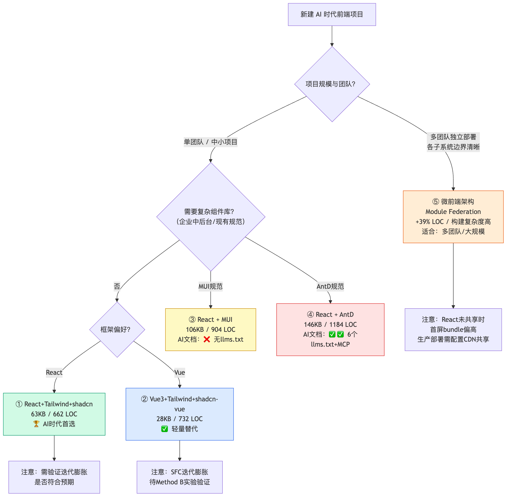
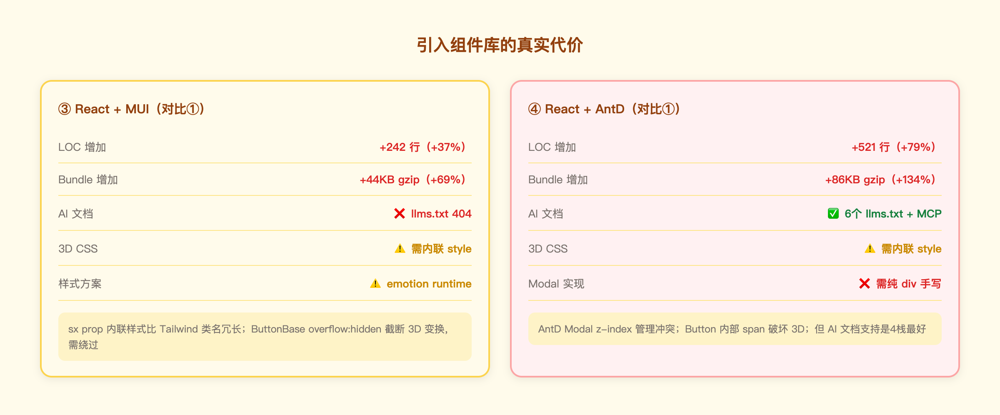

# AI 时代前端技术栈与代码写法处方报告

> 基于 Epic Labs 复杂 demo 的 5 栈对比实验（含微前端架构）  
> 实验日期：2026-06-30 | Playwright 9/9 pass × 5 栈

---

## TL;DR 结论

**首选：React 19 + Tailwind v4 + shadcn/ui（SPA）**

原因：最精简的代码（662 LOC）、最好的 AI 可维护性（函数组件 + 原子类 + 仓库内组件）、合理的 bundle（63 KB gzip）。

**微前端（MF）结论**：相同功能微前端版本 LOC +39%（920 LOC），首屏 bundle +105%（129 KB）。小规模项目架构开销大于收益，需在多团队/大规模场景下才值得引入。

---

## 1. 选型决策树

拿到一个新前端项目，用这棵决策树选型：


*图：有企业规范时沿规范走；无规范时，React+Tailwind 是 AI 时代默认首选。*

---

## 2. 为什么 React + Tailwind 是 AI 时代首选

### 2.1 样式写法：Tailwind 原子类 vs runtime CSS-in-JS

两种样式方案对 AI 的可读性差异是本次实验最核心的发现：


*图：Tailwind className 每个类都是自文档，AI 无需上下文即可理解；MUI sx 需要知道 MUI 主题 token 才能读懂。*

### 2.2 shadcn/ui：copy-in > npm 黑盒

shadcn/ui 的核心理念：**把组件代码复制进你的仓库**，而不是作为 npm 包安装。

对 AI 的意义：
- AI 可以直接 `Read` 和 `Edit` 组件文件，bug 可以在 `/components/ui/button.tsx` 里直接修
- 无需查文档——代码本身就是文档
- 与 MUI/AntD 的黑盒 npm 包形成鲜明对比

### 2.2.0 包管理模式对比：shadcn vs 传统组件库

这是理解 shadcn 与 MUI/AntD 本质差异的基础，两种模式在每个环节都不同：

| 环节 | MUI / AntD（npm 包） | shadcn/ui（copy-in） |
|------|---------------------|---------------------|
| **安装** | `npm install @mui/material` → 进入 node_modules | `npx shadcn add button` → 源码写入 `src/components/ui/` |
| **代码归属** | 库作者所有，你只能调用 | 复制后是你的代码，可以任意修改 |
| **版本锁定** | `package.json` 中有版本号，团队共享同一版本 | 没有版本号，每个组件是独立快照，各自独立演进 |
| **升级方式** | `npm update` 一条命令，自动拉取新版 | 手动重新 `add`，覆盖文件后自行 merge 改动 |
| **Breaking change** | 升级时可能破坏现有代码，需看 changelog | 你不升级就不会有 breaking change，但也收不到 bug fix |
| **bundle 构成** | 整个库打进 node_modules，tree-shake 后仍有基础开销 | 只有你 add 进来的组件，其余不存在于项目中 |
| **样式机制** | MUI：emotion runtime / AntD：cssinjs runtime，运行时注入 | Tailwind 原子类，编译期生成，无运行时开销 |
| **底层依赖** | 自研 headless 逻辑 | Radix UI（headless，无障碍访问内置）+ Tailwind |
| **TypeScript 类型** | 库提供，跟版本绑定 | 复制进来的文件直接含类型，随你改 |
| **出了 bug** | 提 issue → 等官方发版 → npm update | 直接改你自己的文件，下午就上线 |
| **定制样式** | 通过 theme/sx/ConfigProvider 层层覆盖 | 直接改 className，无覆盖层级 |

**本质差异一句话**：MUI/AntD 是你**依赖**的东西，shadcn 是你**拥有**的东西。依赖意味着稳定但受制于人；拥有意味着自由但责任自担。

#### 私有 Registry：shadcn 独有的企业级能力

这是 shadcn 包管理模式最容易被忽视的一个维度，也是它与传统 npm 私有包管理的核心分叉点。

**传统私有组件库的做法**（MUI/AntD 体系下）：
```
内部组件 → 发布到私有 npm registry（如 Verdaccio / 公司 Nexus）
                ↓
消费方：npm install @company/design-system
```
问题：每次改动必须走完整发版流程（bump version → publish → 各项目 npm update），团队耦合在版本号上，协作摩擦大。

**shadcn 私有 Registry 的做法**：
```json
// shadcn.config.json
{
  "registries": [
    {
      "name": "company",
      "url": "https://ui.company.com/registry"  // 你自己的 registry 地址
    }
  ]
}
```
```bash
# 消费方直接 add，源码复制进项目，无需发版
npx shadcn add company/data-grid
npx shadcn add company/rich-upload
```

Registry 本质是一个 JSON 文件服务，每个组件是一个 JSON，描述文件列表和依赖。团队维护这个 JSON 端点，消费方 `add` 时拉取源码直接写入仓库，**跳过了 npm publish 整个流程**。

**两种私有组件管理方式对比**：

| | 私有 npm 包 | shadcn 私有 Registry |
|--|------------|---------------------|
| 发版流程 | 必须 bump version → publish | 直接更新 JSON，无版本号 |
| 消费方升级 | `npm update @company/ui` | 重新 `npx shadcn add company/xxx` |
| 版本一致性 | package.json 强制锁定 | 无约束，各项目独立演进 |
| 组件定制后升级 | 改了源码就无法通过 npm 升级 | 一样需要手动 merge，但流程更轻 |
| 适合场景 | 需要强版本管控、多团队强一致 | 组件相对稳定、各团队需要定制空间 |
| 搭建成本 | 需要维护 npm registry 服务 | 一个静态 JSON 端点即可，可放 CDN |

> **实际含义**：对于有内部设计系统的企业团队，shadcn registry 提供了一种**比发 npm 包更轻、比 git submodule 更灵活**的组件共享方案。代价是失去了版本强一致性的保证。

### 2.2.1 shadcn/ui 的真实风险

copy-in 把责任从库作者转移给了你，这不是没有代价的：

**风险 1：组件升级需要手动 merge**

shadcn 官方修了 bug 或改了交互，你不会自动收到。要更新必须：
1. 重新 `npx shadcn add dialog` 覆盖
2. 把你之前对该文件的改动手动 merge 回去

改动越多，merge 越痛。这是 copy-in 模式固有的成本，无法消除。

**风险 2：复杂组件覆盖不足**

shadcn 共 66 个组件，AntD 5 有 72 个核心组件（另有 6 个 Pro 专业组件），MUI v7 约 57 个。数量不是关键，关键是**类型分布**——shadcn 缺的恰好是业务系统最常用的高阶组件（详见 2.2.2）。

遇到这些，要么自建，要么引入其他专项库（如 TanStack Table），引入后就又回到了"外部依赖"的问题。

### 2.2.2 组件覆盖对比：shadcn vs AntD vs MUI

**组件总数（2026年数据）**

| 库 | 核心组件数 | 备注 |
|----|-----------|------|
| shadcn/ui | 66 | 近期新增 AI 对话类组件（Bubble、Attachment 等） |
| Ant Design 5 | 72 + 6 Pro | Pro 含 ProTable/ProForm 等企业级增强 |
| MUI v7 | ~57 | Lab 中另有部分实验性组件 |

**基础组件（三库基本都有）**

Button、Input、Select、Checkbox、Radio、Switch、Slider、Avatar、Badge、Card、Dialog/Modal、Tabs、Pagination、Progress、Skeleton、Tooltip、Breadcrumb、Dropdown、Table（基础）、Alert、Drawer

**高阶组件缺口（AntD 有，shadcn 没有或残缺）**

| 组件 | AntD | MUI | shadcn | 说明 |
|------|:----:|:---:|:------:|------|
| DatePicker / RangePicker / TimePicker | ✅ | ❌ | ⚠️ | shadcn 只有 Calendar，无范围选择、无时间、无国际化 |
| Cascader（级联选择） | ✅ | ❌ | ❌ | 省市区三级联动场景必需 |
| TreeSelect | ✅ | ❌ | ❌ | 树形数据选择 |
| Transfer（穿梭框） | ✅ | ✅ Lab | ❌ | 权限分配等场景常用 |
| ColorPicker | ✅ | ❌ | ❌ | |
| Upload（带进度/预览） | ✅ | ❌ | ❌ | shadcn 无此组件 |
| Rate（星级评分） | ✅ | ✅ | ❌ | |
| InputNumber | ✅ | ❌ | ❌ | 数字步进输入 |
| Mentions（@提及） | ✅ | ❌ | ❌ | |
| Tree | ✅ | ❌ | ❌ | 文件树、组织架构 |
| Steps / Stepper | ✅ | ✅ | ❌ | 多步流程引导 |
| Tour（引导/onboarding） | ✅ | ❌ | ❌ | |
| QRCode | ✅ | ❌ | ❌ | |
| Image（带放大/预览组） | ✅ | ❌ | ❌ | shadcn 无图片预览组件 |
| Statistic（数值展示） | ✅ | ❌ | ❌ | 大数字 + 趋势 |
| Timeline | ✅ | ✅ Lab | ❌ | |
| Watermark | ✅ | ❌ | ❌ | |
| Result（404/成功/错误页） | ✅ | ❌ | ❌ | |
| Descriptions（键值布局） | ✅ | ❌ | ❌ | 详情页 label:value 布局 |
| FloatButton | ✅ | ✅ FAB | ❌ | |
| Segmented（分段控制器） | ✅ | ❌ | ❌ | |
| Form（内置校验体系） | ✅ | ❌ | ❌ | shadcn 无内置表单校验，需搭配 react-hook-form |
| Table（虚拟滚动/列拖拽） | ✅ | ⚠️ 基础 | ⚠️ 食谱，无虚拟滚动 | 大数据量表格 shadcn 需引 TanStack Table |

**结论**：shadcn 缺失的 20+ 个高阶组件，集中在**数据录入**（DatePicker、Cascader、Upload）和**数据展示**（Tree、Image、Timeline、Result）两大类，正是中后台系统的核心场景。纯前台展示型产品受影响小，后台管理系统选 shadcn 需认真评估补缺成本。

**风险 3：团队需要有维护意愿**

组件代码在仓库里意味着：它是你的技术债，不是别人的。如果团队对这些文件放任自流（各处随意修改、无人 review），最终会变成一堆 fork 出来没人能看懂的代码，比黑盒组件库更难维护。

**适合 shadcn 的团队特征**：组件数量需求有限、有 UI 定制需求、以 AI 辅助开发为主、团队有意愿对组件层代码负责。

### 2.3 可测量的数据证据

| 维度 | ① React+Tailwind | ② Vue SFC | ③ MUI | ④ AntD | ⑤ MF（react-shadcn-mf） |
|------|:-:|:-:|:-:|:-:|:-:|
| LOC（单次） | **662** | 733 | 904 | 1183 | 920（+39% vs ①） |
| Bundle gzip（首屏） | 63 KB | **28 KB** | 106 KB | 146 KB | 129 KB（preview 模式）|
| AI 文档 | ✅ | ✅ | ❌ | ✅✅ | ✅ |
| 组件可直接修改 | ✅ | ✅ | ⚠️ | ⚠️ | ✅ |
| 架构 | SPA | SPA | SPA | SPA | 微前端 |
| 构建复杂度 | 低（1次） | 低（1次） | 低（1次） | 低（1次） | 高（4次 + patch） |

---

## 3. 代码写法 5 要点


*图：5 个推荐写法（左栏）vs 4 个 AI 追加膨胀的风险写法（右栏）。*

### 要点 1：纯函数组件，一组件一文件

```tsx
// ✅ 好：纯函数，可独立测试，AI 可独立生成
export default function DragFillStar({ pieces, slots, onComplete }: Props) {
  const [dragId, setDragId] = useState<string | null>(null)
  return <div className="relative w-full h-full" onPointerMove={onMove}>...</div>
}
```

### 要点 2：Tailwind 原子类，拒绝 runtime 样式

Tailwind v4 编译期消除，生产包里只有用到的类：
- 本 demo 中约 120 个唯一类 → 编译后 CSS 15.5 KB
- MUI emotion runtime 即使树摇也有 ~30 KB 的基础开销

### 要点 3：最小化 useEffect，副作用显式

```tsx
// ✅ 好：明确知道是"持久化副作用"
useEffect(() => {
  saveProgress({ level: levelIdx, completed: [...completed] })
}, [levelIdx, completed])
```

### 要点 4：useRef 处理时序敏感逻辑

React state 更新是异步的，在 pointer 事件中不能依赖 state 当前值：

```tsx
// ❌ 错误：onPointerUp 执行时 draggingId state 可能还是 null
const [draggingId, setDraggingId] = useState<string | null>(null)

// ✅ 正确：ref 保证同步读取
const dragIdRef = useRef<string | null>(null)
const onPointerDown = (pid: string) => {
  dragIdRef.current = pid   // 同步写
  setDragId(pid)            // 触发 re-render
}
const onPointerUp = () => {
  const pid = dragIdRef.current  // 同步读，总是最新值
}
```

> 本次实验中 ③④ 的 DragFillStar 初版就因为这个 bug 导致拖拽失效，用 ref 模式修复后全部通过。

### 要点 5：TypeScript 类型驱动接口设计

```ts
export interface Star {
  id: string
  type: 'drag-fill' | 'flip-match' | 'hotspot' | 'quiz-single'
  pos: { x: number; y: number }
  dragFill?: DragFillConfig
}
```

---

## 4. 框架选择：React vs Vue SFC

本次实验单次快照 Vue SFC 仅比 React 多 11% LOC，体积更小（28 KB vs 63 KB）。Vue SFC 不应被轻易否定。

**"AI 反复追加导致 Vue SFC 膨胀"**是一个合理假设，但**尚未被本 demo 证实**。需要专项 Method B 实验验证。

**当前建议**：
- 新项目纯前端：React + Tailwind
- 已有 Vue 规范的团队：继续 Vue，但注意控制 SFC 单文件大小（> 200 LOC 时考虑拆分）

**微前端架构对框架选择的影响**：本次 MF 实验基于 React + Tailwind（①）实现，未测试 Vue MF 版本。理论上 Vue 的 SFC 三段式在 MF 子应用隔离场景下不会放大膨胀风险（子应用独立，无共享状态），但也不会改变 Vue SFC 本身的 LOC 特征。

---

## 5. 组件库选择：引入的真实代价

若业务必须使用组件库，需清醒认识代价：


*图：MUI LOC +37%、bundle +68%；AntD LOC +79%、bundle +132%；但 AntD AI 文档支持反而最好。*

**AntD 的反常之处**：虽然代价最大，但 AI 文档支持（6 个 llms.txt + MCP 工具）是 4 个 SPA 栈中最好的——对重度依赖 AI 辅助的团队，这是真实优势。

**微前端架构 vs 组件库代价**：相比引入 MUI/AntD，微前端架构带来的 LOC 开销（+39%）处于中间水平（MUI +37%，AntD +79%）。但微前端的代价是**架构复杂度**（构建 × 4、remoteEntry patch、CSS 作用域），而不是组件抽象层的冗余——两种代价性质不同，需结合项目场景权衡。

---

## 6. 实验边界说明

本 demo 是**单次快照测量**，以下结论**尚未验证**：
- Vue SFC 在 AI 迭代 5 轮后的膨胀程度
- 各栈在"需求变更"场景下的可维护性差异
- 多模型（GPT-4/Gemini）下的生成质量对比
- 微前端在大规模场景（> 10 子应用、多团队）下的实际收益是否覆盖架构开销
- 微前端 Vue SFC 版本 vs React MF 版本的对比

---

*完整对比数据见 `docs/experiment-reports/comparison-report.md`*  
*测试脚本见 `demo/_test/test.mjs`（Playwright 9 项，5 栈全通过）*  
*微前端详细数据见 `docs/experiment-reports/measurements/method-mf/mf-single-shot.md`*
