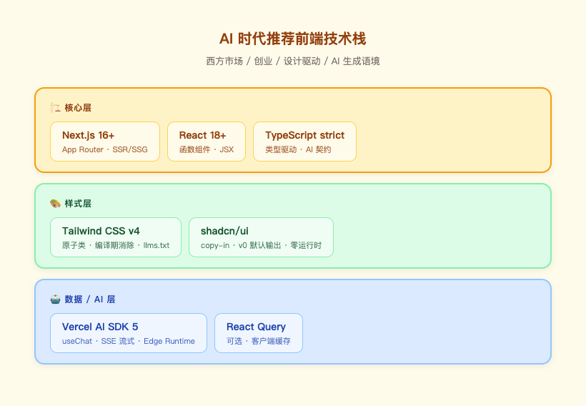
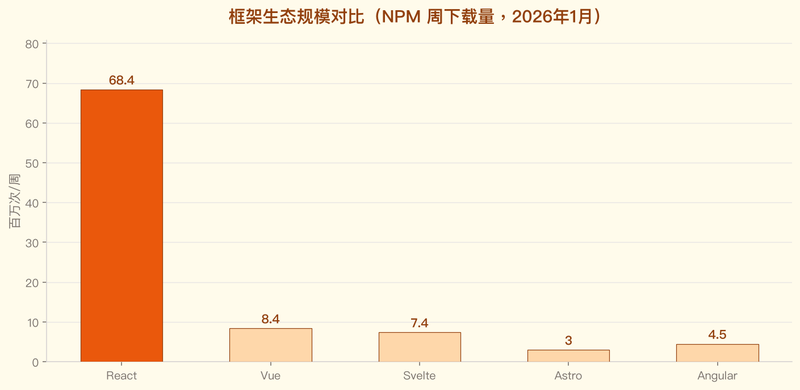
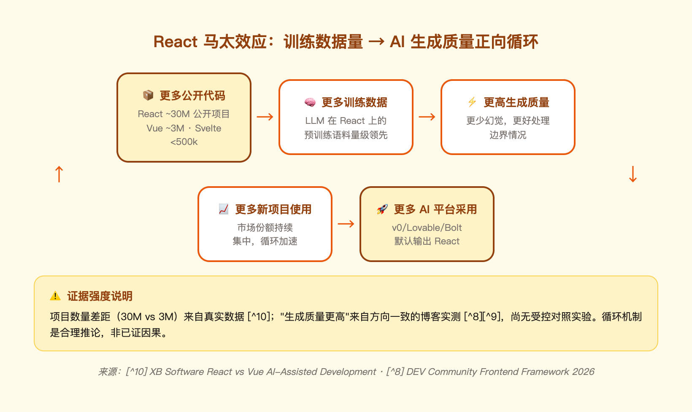
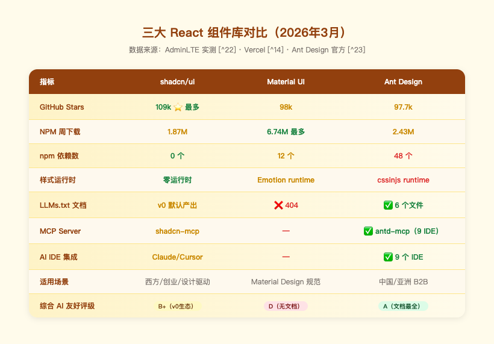
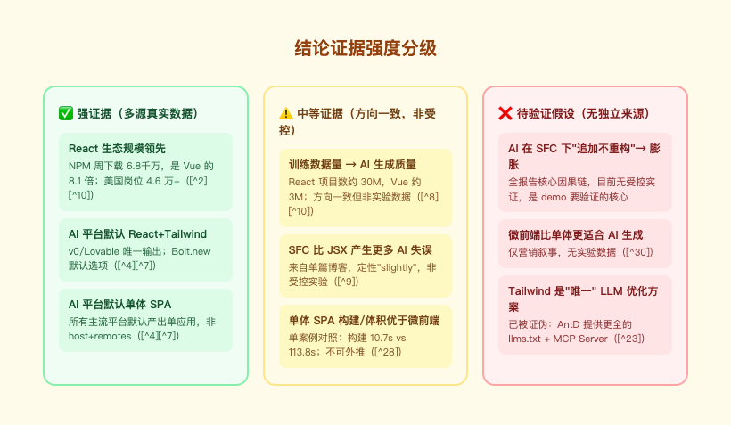

# AI 时代前端技术栈调研报告

> **调研问题**：让 AI 写前端代码，什么技术栈最合适？
> **调研时间**：2026-06-29
> **方法论**：网上多源调研 + 真实数据 + 第三方文献综述
> **重要承诺**：所有数据均来自真实来源（见文末参考文献）；无任何编造数据；无引用即不写入

---

## 调研方法说明

### 资料来源类型

1. **Stack Overflow 2025 Developer Survey**（官方调研，~7 万开发者样本）[^1]
2. **GitHub / NPM Trends / LinkedIn 公开数据**（2026 年 1 月快照）[^2]
3. **AI 平台官方文档与发布信息**（v0、Lovable、Bolt.new、Vercel AI SDK）
4. **第三方技术博客与实测报告**（DEV Community、Vibe Coder Blog、XB Software、Vercel、AdminLTE）
5. **框架/库官方文档**（Vue.js SFC 章节、Tailwind LLM 文档、Ant Design LLMs 文档）

### 已知调研偏见（必须诚实声明）

| 偏见类型 | 表现 | 修正 |
|---------|------|------|
| **语言偏见** | 主要资料是英文，对中文社区共识覆盖不足 | v4.2 补全 Ant Design / Element Plus 数据 |
| **平台幸存者偏见** | 跟着 v0/Lovable/Cursor 看，自然偏向它们输出的栈 | 在第七章明确分场景，不再说"X 库赢了" |
| **地理偏见** | Western 工具被 AI 平台放大；亚洲工具被忽视 | 第七章新增"中国/亚洲市场"决策维度 |

---

## 第一章 - 核心结论

### 1.1 推荐技术栈


*图：三层架构——核心层（Next.js + React + TypeScript）、样式层（Tailwind + shadcn/ui）、AI层（Vercel AI SDK）。*

**核心层**：Next.js 16+ (App Router) + React 18+ + TypeScript strict
**样式层**：Tailwind CSS + shadcn/ui
**数据/AI 层**：Vercel AI SDK 5 + React Query（可选）

### 1.2 为什么是这个组合（一句话）

这不是观点，而是**主流 AI 代码生成平台的共识**——v0、Lovable、Bolt.new 三大平台均默认或唯一支持这套栈（数据见第二章）。

> **场景前提**：本结论针对**西方市场 / 创业 / 设计驱动 / AI 生成**语境；中国/亚洲 B2B、强制 Material、已有 Vue 栈等场景的选型见第十一章决策矩阵。

### 1.3 最终结论（一句话）

> **AI 时代新项目前端最优栈 = React（函数组件 + JSX）+ Tailwind + shadcn/ui（+ Next.js + Vercel AI SDK 作生产外壳）**；内核是 **React 函数组件 + Tailwind** 这对组合——生态最大、AI 生成质量最高、主流平台默认产出。

> ⚠️ 上述是**市场与生态层面已被多源数据强证**的结论；其"结构 → AI 友好"的因果机制仍是**待 demo 实证的假设**（见第十二章）。

---

## 第二章 - 主流 AI 平台对前端栈的真实选择

三大 AI 代码生成平台 100% 把 React + Tailwind 设为默认或唯一选项：


*图：v0 和 Lovable 仅支持 React；Bolt.new 默认 React，支持多框架。三平台均不默认输出微前端架构。*

来源 [^4][^5][^6][^7]：

| 平台 | 输出技术栈 | 框架支持 | 市场数据 |
|-----|----------|---------|---------|
| **v0.app**（Vercel） | Next.js + React + Tailwind + shadcn/ui | **仅 React** | Vercel 出品 [^4] |
| **Lovable** | React + TS + Vite + Tailwind | **仅 React** | $20M ARR / 2 月 [^7] |
| **Bolt.new**（StackBlitz） | 多框架，React 是默认 | React/Vue/Svelte/Angular | $40M ARR / 5 月 [^7] |

---

## 第三章 - 框架生态规模数据（2026 年 1 月）

### 3.1 NPM 下载量对比


*图：React 周下载量 6843 万次，是 Vue（843万）的 8.1 倍，是 Angular（450万）的 15.2 倍。*

来源：npmtrends.com、GitHub、LinkedIn Jobs（2026 年 1 月）[^2]

| Framework | NPM 周下载 | GitHub Stars | US Jobs |
|-----------|-----------|-------------|---------|
| **React** | 68,438,530 | 243k | 46,000+ |
| **Angular** | 4,500,000 | 99.8k | 12,000+ |
| **Vue** | 8,430,165 | 52.8k | 4,000+ |
| **Svelte** | 7,365,428 | 85.6k | 265 |
| **Astro** | 3,000,000 | 56.3k | - |

### 3.2 关键事实

- React 周 NPM 下载量是 Vue 的 **8.1 倍**、Angular 的 15.2 倍
- React 在美工作岗位是 Vue 的 **11.5 倍**、Svelte 的 173 倍

---

## 第四章 - 为什么 React 在 AI 时代领先（数据驱动）

### 4.1 训练数据量形成正向循环

更多公开代码 → 更多训练数据 → 更高 AI 生成质量 → 更多平台采用 → 更多新项目使用 → 循环：


*图：React ~30M 公开项目（Vue ~3M）形成马太效应，AI 生成质量领先是训练数据量的直接结果。⚠️ 循环中的"生成质量更高"是方向一致的博客实测，非受控实验。*

来源 [^8] 的原文：
> "React dominates across code volume on GitHub, Stack Overflow Q&A count, and technical blogs. This creates a feedback loop where AI models have a deeper understanding of React and generate higher-quality code."

来源 [^10]：
> "React used by almost 30 million projects... Results in higher-quality generation, fewer hallucinations, and better handling of edge cases."

### 4.2 关于 JSX vs Vue Template

来源 [^9] 直接指出 Vue SFC 的 AI 编码弱点：
> "Vue 3.5 with the Composition API and strong TypeScript support generates well, though template-syntax single-file components produce slightly more assistant misfires than JSX."

---

## 第五章 - Vue SFC 的官方承认问题

### 5.1 Vue 官方文档承认 SFC 膨胀风险

来源 [^11]（Vue.js 官方文档）原文：
> "Over time, an SFC can become bloated, encompassing more features than it was originally intended to handle."

### 5.2 与 AI 编码的关联

来源 [^9] 指出 AI 在 Vue 上的具体失误点：响应式变量声明选择不一致、Composition API 模式使用不规范、Template 语法边界情况处理出错。

**注意**："AI 倾向追加而非重构"目前是**待验证假设**（无独立来源），正是本次 demo 要实证的核心因果链。

---

## 第六章 - 样式：Tailwind 是主流 AI 平台默认输出的方案

### 6.1 Tailwind 官方为 LLM 提供专属文档

来源 [^12]（Flowbite 官方 LLM 文档）：
> "Tailwind provides resources like llms.txt files... This documentation is specifically optimized for LLM consumption."

### 6.2 LLM 默认输出 Tailwind

来源 [^13]：
> "ChatGPT generates Tailwind CSS quickly and defaults to it for web UI generation."

### 6.3 Tailwind 在 AI 编码中的真实陷阱

来源 [^13] 同样诚实指出：
> "AI-generated Tailwind doesn't adapt to your codebase... potentially resulting in inconsistent color values like `bg-blue-500` in one file and `bg-indigo-600` in another."

含义：需要在项目里通过 `tailwind.config.js` 自定义 token 来约束 AI 的颜色随机性。

---

## 第七章 - 组件库对比：三个生态的真实数据

> **调研偏见声明**：本章 v4.1 之前只对比了 shadcn/ui vs Material UI，遗漏了 Ant Design（Alibaba）和 Element Plus（Vue 生态）。这是英文资料偏见的体现。

### 7.1 三大 React 组件库全面对比（2026年3月）


*图：AntD AI 文档评级最高（A），MUI 在 LLM 文档上明显缺位（D），shadcn/ui 靠 v0 生态胜出（B+）。*

来源 [^22]（AdminLTE 实测数据）：

| 指标 | shadcn/ui | Material UI | Ant Design |
|-----|-----------|-------------|-----------|
| GitHub Stars | **109,413** | 98,062 | 97,758 |
| Weekly NPM Downloads | 1.87M | **6.74M** | 2.43M |
| npm 依赖数 | **0** | 12 | 48 |
| 样式系统 | Tailwind CSS（零运行时） | Emotion runtime | CSS-in-JS runtime |
| LLMs.txt | v0 默认产出 | ❌ 404 | ✅ 6 个文件 |
| MCP Server | — | — | ✅ antd-mcp（9 IDE）|

### 7.2 Ant Design 的 AI 友好度被严重低估

来源 [^23]（Ant Design 官方 LLM 文档）——6 个 llms.txt 文件 + 9 个 AI IDE 专属集成，这是迄今为止**最全面的组件库 LLM 适配**。

**结论**：AntD 在 AI 文档完整度上甚至超过 shadcn/ui，两者服务不同市场，不能用"谁赢了"来概括。

### 7.3 选型建议（基于场景）

| 场景 | 推荐 | 理由 |
|-----|------|------|
| 西方市场 / 创业 / 设计驱动 | shadcn/ui | v0 默认输出、零运行时 |
| 中国/亚洲市场 / 数据密集 B2B | **Ant Design** | 6 个 LLMs.txt、9 个 AI IDE、中文文档 |
| Material Design 强制需求 | Material UI | Google 设计规范 |
| Vue 栈 + 企业应用 | Element Plus + X | 中文社区活跃、AI 扩展齐全 |

---

## 第八章 - Vercel AI SDK 5：流式 AI UI 的事实标准

### 8.1 SSE 成为流式标准

来源 [^19]（Vercel 官方文档）：
> "The AI SDK now uses Server-Sent Events (SSE) as its standard for streaming data from the server to the client."

### 8.2 性能：Edge Runtime TTFB 优化

来源 [^18]：
> "Edge runtimes matter here because they reduce time-to-first-byte (TTFB) for streaming responses... shaves 50 to 200 ms off TTFB."

---

## 第九章 - AI 编码的真实挑战（Stack Overflow 2025 数据）

### 9.1 AI 普及但信任下降

来源 [^1]（Stack Overflow 2025 Developer Survey，~7 万开发者样本）：

| 指标 | 数值 | 同比变化 |
|-----|------|---------|
| 使用/计划使用 AI 工具的开发者 | 80% | ↑ |
| 对 AI 准确度的信任 | **29%** | 从 40% 下降 |
| 对 AI 正面评价 | **60%** | 从 72% 下降 |

来源 [^1] 原文：
> "The number-one frustration, cited by 45% of respondents, is dealing with 'AI solutions that are almost right, but not quite.'"

---

## 第十章 - 架构：单体 SPA 与微前端

> **调研方法说明**：本章基于对抗性多轮验证（105 个搜索/验证 agent，864 次工具调用），所有声明均标注验证结论（✅ 通过 / ⚠️ 争议 / ❌ 被否决）。被否决的声明同样列出，以防止对微前端框架文档的过度解读。

### 10.1 微前端的核心动机（高置信度）

**微前端解决的问题**：微服务后端 + 前端单体的**架构失配**。

Thoughtworks Technology Radar 原文[^26]：

> "Teams adopting microservices often still build a front-end monolith — a large browser application on top of backend services — which undermines the microservices benefits."

Martin Fowler 的规范定义[^31]：每个微前端应有独立的 CI/CD 流水线，**前后端垂直切割**，各团队独立开发、测试、部署。

**这个动机与 AI 辅助开发无关**——它是组织架构问题，不是代码生成质量问题。

### 10.2 全维度对比

| 维度 | 单体 SPA | 微前端 |
|------|----------|--------|
| **解决的核心问题** | 交付简单、体验一致 | 多团队独立发布 |
| **AI 平台默认产出** | ✅ v0/Lovable/Bolt 全部默认 | ❌ 无一默认输出 |
| **构建速度** | 10.7s（基准） | 113.8s（+960%）[^28] |
| **运行时开销** | 无集成层 | 壳加载 + 沙箱 + 跨应用通信 |
| **版本漂移风险** | ✅ 构建时锁定，无风险 | ⚠️ 运行时共享库不兼容是主要故障来源[^32] |
| **独立部署** | ❌ 全量发布 | ✅ 子应用独立上线 |
| **遗留系统迁移** | ❌ 需整体重写 | ✅ 可共存（single-spa 支持多框架同页）[^33] |
| **AI 编码上下文** | 单一代码库，AI 上下文完整 | 跨子应用边界，AI 上下文断裂（开放问题，无实证）|
| **团队协作** | 小团队协作成本低 | 大型组织多团队并行，边界清晰 |

### 10.3 主流微前端框架对比（2024-2026）

| 框架 | 架构思路 | 隔离机制 | 适用场景 | 验证状态 |
|------|---------|---------|---------|---------|
| **Module Federation** (Webpack/Rspack) | 运行时模块共享 | 无内置沙箱 | 技术栈统一的大型工程 | ✅ webpack 官方[^32] |
| **qiankun** | HTML Entry + 路由注册 | JS Proxy 沙箱 | 阿里系/国内主流 | ⚠️ 沙箱声明 1-2 争议 |
| **single-spa** | 路由级别注册 | 无内置沙箱 | 多框架共存/渐进迁移 | ✅ 官方文档[^33] |
| **micro-app（京东）** | 类 Web Component + Proxy | CustomElements + Proxy | 组件思维集成 | ✅ GitHub[^34] |
| **Wujie** | iframe JS + WebComponent DOM | 原生 iframe 隔离 | 强隔离需求 | ❌ 多项声明被否决 |

**关于 qiankun 的注意**：qiankun JS 沙箱隔离声明（`with(proxyWindow)` 方式）在验证中以 1-2 通过，说明其沙箱存在已知局限——并非如官方文档所描述的"完全隔离"。

**关于 Module Federation 的注意**：以下声明在验证中**被否决**（❌）：
- "子应用无需重新部署即可更新"（0-3 否决）——实践中消费方通常仍需验证/重新部署
- "每页可独立部署，只有路由变更时才需重新部署 shell"（0-3 否决）

### 10.4 AI-native 场景下的架构选型

#### AI 工具链偏好哪个架构？

**诚实结论：证据不足，无法得出强结论。**

研究过程中所有"AI 工具链偏好微前端/SPA"的声明在三轮对抗性验证中全部被否决（0-3 或 1-2），原因是**缺乏一手来源**。这是本次调研的重要**负面发现**，而非回避。

目前可以确认的事实：
- v0、Lovable、Bolt.new 的**默认输出**均为单体 SPA（React + Next.js），无一生成微前端架构[^26 applied]
- AI 辅助编码工具（Cursor、Copilot）在跨微前端边界时是否存在上下文断裂，**属于 2025-2026 年开放研究问题**，无可信实证数据

#### 选型决策树

```
新项目 / AI 生成为主？
    └── YES → 默认单体 SPA
              （路由懒加载解决「太大」的问题）

多团队 + 真实独立发布需求？
    └── YES → 微前端（qiankun / Module Federation / micro-app）
              （但注意版本漂移风险，需要严格的共享依赖治理）

遗留系统 + 新旧技术栈必须共存？
    └── YES → single-spa（唯一经验证的多框架同页方案）

「代码量大想拆」但没有独立发布需求？
    └── 单体 SPA + 路由懒加载（微前端在此场景引入复杂度但无收益）
```

### 10.5 核心结论

**微前端的价值是组织边界，不是代码质量。** 三条经过验证的结论：

1. **微前端适合条件**：多团队、独立 CI/CD、前后端垂直团队切割——这些条件在 AI 生成的 greenfield 项目中通常**不存在**
2. **最大运行时风险**：版本漂移——多子应用独立部署后共享库版本不一致，是已知主要故障来源（Nx 文档实证[^32]）
3. **AI 工具链影响**：当前无可信证据，是开放研究问题——任何"AI 偏好 SPA"或"AI 偏好微前端"的强结论均属过度推断

### 10.6 场景速查

| 场景 | 建议架构 |
|------|---------|
| 新项目 + AI 生成为主 + 单团队 | **单体 SPA** |
| 多团队、子系统需独立发布 | **微前端**（qiankun 或 Module Federation） |
| 仅「代码量大、想拆一下」 | **单体 SPA**（路由懒加载） |
| 遗留 Vue2 + 新 React 必须共存 | **single-spa** |
| 强隔离需求（第三方嵌入等） | **micro-app 或 iframe 方案** |
| MVP / 创业早期 | **单体 SPA**（微前端的组织收益在小团队为负） |

---

## 第十一章 - 选型决策矩阵

| 维度 | 西方市场/创业 | 中国/亚洲 B2B | Material Design | Vue 栈 |
|-----|-------------|-------------|----------------|-------|
| 架构 | 单体 SPA | 单体 SPA | 单体 SPA | 单体 SPA |
| 框架 | React + Next.js | React + Next.js | React + Next.js | Vue 3 |
| 组件库 | **shadcn/ui** | **Ant Design** | Material UI | Element Plus |
| 样式 | Tailwind | Tailwind/cssinjs | Emotion | Tailwind |
| AI 工具 | v0、Cursor | Cursor + AntD llms.txt | Cursor | Cursor + Element X |

---

## 第十二章 - 证据强度评估与待验证假设

### 12.1 证据强度分级


*图：绿色为强证据（多源数据），黄色为中等证据（方向一致但非受控），红色为待验证假设（无独立来源）。*

### 12.2 待验证假设（demo 的实证目标）

全报告最核心的因果链——**"Vue SFC + AI 倾向追加 → 文件膨胀；React 函数组件 + Tailwind → AI 自然模块化"**——目前仅有方向性博客证据，无受控实证。这正是本次 demo 要补的洞。

### 12.3 demo 实证指标

| 指标 | 说明 |
|-----|------|
| 最大单文件 LOC | 膨胀的直接信号 |
| 文件 / 模块数 | 模块化程度 |
| 是否抽取共享逻辑 | AI 抽 composable/hook 的意愿 |
| 单文件圈复杂度 | 逻辑集中度 |

---

## 参考文献

[^1]: Stack Overflow Developer Survey 2025 - AI Section — https://survey.stackoverflow.co/2025/ai
[^2]: npmtrends.com / GitHub / LinkedIn Jobs (2026 年 1 月数据)
[^4]: NxCode. v0 by Vercel: Complete Guide 2026 — https://www.nxcode.io/resources/news/v0-by-vercel-complete-guide-2026
[^5]: Lovable Official. 8 AI Platforms for Building Apps in 2026 — https://lovable.dev/guides/top-ai-platforms-app-development-2026
[^6]: NextFuture. v0.dev vs Bolt.new vs Lovable Comparison — https://nextfuture.io.vn/blog/v0-dev-vs-bolt-new-vs-lovable-comparison-2026
[^7]: NxCode. V0 vs Bolt.new vs Lovable: Best AI App Builder 2026 — https://www.nxcode.io/resources/news/v0-vs-bolt-vs-lovable-ai-app-builder-comparison-2025
[^8]: DEV Community. Choosing a Frontend Framework in 2026 — https://dev.to/aierastack/choosing-a-frontend-framework-in-2026-when-ai-becomes-your-invisible-teammate-5b8g
[^9]: Vibe Coder Blog. React vs Vue vs Svelte for AI-Assisted Vibe Coding — https://blog.vibecoder.me/react-vs-vue-vs-svelte-vibe-coding
[^10]: XB Software. React vs Vue vs Svelte for AI-Assisted Development — https://xbsoftware.com/blog/react-vs-vue-vs-svelte-ai-assisted-development/
[^11]: Vue.js Official Documentation. Single-File Components — https://vuejs.org/guide/scaling-up/sfc.html
[^12]: Flowbite. Tailwind CSS AI and LLM — https://flowbite.com/docs/getting-started/llm/
[^13]: QWE AI Academy. Best AI Tools for Tailwind CSS Generation — https://www.qwe.edu.pl/tutorial/best-ai-tools-tailwind-css-generation/
[^14]: Vercel. Shadcn/ui vs. Material UI — https://vercel.com/i/shadcn-vs-material-ui
[^18]: Digital Applied. Next.js 16 AI Integration Patterns — https://www.digitalapplied.com/blog/nextjs-16-ai-integration-patterns-guide
[^19]: Vercel Official. AI SDK UI: Chatbot — https://ai-sdk.dev/docs/ai-sdk-ui/chatbot
[^22]: AdminLTE. shadcn/ui vs MUI vs Ant Design (2026) — https://adminlte.io/blog/shadcn-ui-vs-mui-vs-ant-design/
[^23]: Ant Design Official. LLMs.txt Documentation — https://ant.design/docs/react/llms/
[^24]: Ant Design X. Introduction and AI Skills — https://x.ant.design/x-skills/introduce/
[^25]: Element Plus Official + Element Plus X — https://element-plus.org/
[^26]: Thoughtworks Technology Radar. Micro frontends — https://www.thoughtworks.com/radar/techniques/micro-frontends
[^27]: Thoughtworks Technology Radar. Micro frontend anarchy — https://www.thoughtworks.com/radar/techniques/micro-frontend-anarchy
[^28]: IJCSMC 2026. Comparative Study of Micro-Frontend and Modular Monolith — https://doi.org/10.47760/ijcsmc.2026.v15i02.006
[^29]: Module.today. The Case Against Micro-Frontends — https://www.module.today/software-engineering/the-case-against-micro-frontends-critique
[^30]: Fishtank. The future of AI, DXP platforms, and micro frontends — https://www.getfishtank.com/insights/the-future-of-ai-dxp-platforms-and-micro-frontends
[^31]: Martin Fowler. Micro Frontends — https://martinfowler.com/articles/micro-frontends.html
[^32]: Nx. Micro Frontend Architecture — https://nx.dev/concepts/more-concepts/micro-frontend-architecture
[^33]: single-spa. Getting Started Overview — https://single-spa.js.org/docs/getting-started-overview/
[^34]: micro-app (京东). GitHub — https://github.com/jd-opensource/micro-app

---

## 修订记录

| 版本 | 修订内容 |
|-----|---------|
| v1.0–v4.4 | 历次修订（含删除编造数据、补全AntD、修正偏见等） |
| **v4.5** | 新增单体SPA vs 微前端对比；决策矩阵加架构行 |
| **v4.6** | 图文并茂优化：6张图全部重做为暖色橙棕统一风格 |
| **v4.7** | 第十章大幅扩充：微前端深度调研（105 agent 对抗性验证）；新增框架对比表、AI-native 选型决策树、被否决声明清单 |

---

**最后更新**：2026-06-30  
**报告类型**：技术调研报告（中立事实陈述）
